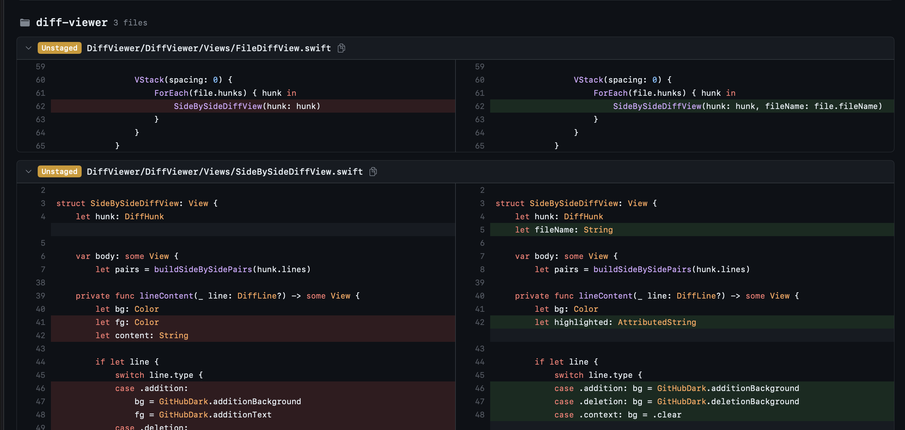

# DiffViewer

A macOS app to view Git diffs across multiple local repositories at a glance.
Launcher-style diff viewer that can be summoned anytime with a global shortcut (`Cmd + Ctrl + D`).



## Install

```
brew install nyshk97/tap/diff-viewer
```

## Setup

Add the paths of the repositories you want to monitor to the config file.

```
mkdir -p ~/.config/diff-viewer
```

```json
// ~/.config/diff-viewer/config.json
{
  "repositories": [
    "/Users/you/project-a",
    "/Users/you/project-b"
  ],
  "shortcut": {
    "key": "d",
    "modifiers": ["command", "control"]
  }
}
```

The `shortcut` field is optional (defaults to `Cmd + Ctrl + D`). Available modifiers: `command`, `control`, `option`, `shift`. Changing the shortcut requires an app restart.

## Usage

1. Launch the app (it stays in the menu bar)
2. Press `Cmd + Ctrl + D` (or your custom shortcut) to show the panel
3. Press the same shortcut again to dismiss
